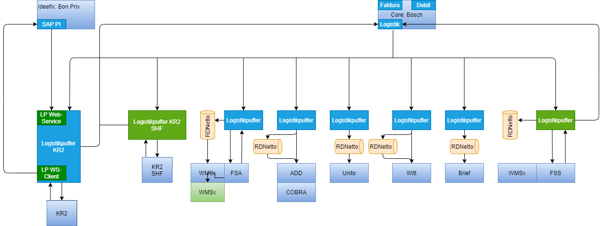

#Tiere
Tiere sind vielzellige Lebensformen, die eine Form heterotrophen Stoff- und Energiewechsels betreiben, somit in der 
Ernährung auf Körpersubstanz oder Stoffwechselprodukte anderer Organismen angewiesen sind, und keine Pilze sind.

Innerhalb der irdischen Lebensformen bilden die Tiere ein eigenes Reich namens Animalia.[1] Dieses Reich wird heutzutage 
gleichgesetzt mit dem Taxon der Metazoa.[2] Demzufolge ist die Gruppe der eigentlichen Tiere deckungsgleich mit der 
Gruppe der vielzelligen Tiere. Nach moderner Auffassung existieren keine einzelligen Tiere, obwohl dies traditionell 
anders gesehen wurde.[3] Sämtliche Tiere entwickelten sich aus einer gemeinsamen Stammform und sind untereinander näher 
verwandt als mit allen anderen Lebewesen. Die Tierwelt wird mit dem Begriff der Fauna umschrieben. Die Naturwissenschaft 
von den Tieren heißt Zoologie.

Zu zoologischen Aspekten der Tiere → siehe Hauptartikel: Metazoa

Der Mensch wird in der Biologie zu den Tieren gezählt. Bestimmte nicht-naturwissenschaftliche Disziplinen – 
darunter Rechtswissenschaft und Theologie – rechnen ihn nicht zu ihnen. Das Verhältnis zwischen Tier und Mensch ist 
Forschungsgegenstand der Tierphilosophie.

